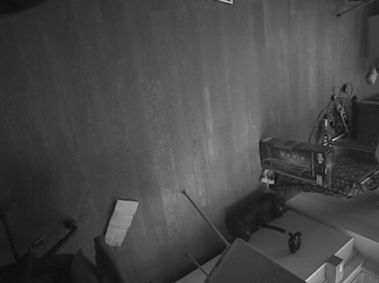

Aero optical flow with ROS
==========================

This package computes the Optical flow from the Intel aero downfacing camera and **publish the full image to ROS** (for other processing to be done).

It is meant to replace the original service [https://github.com/intel-aero/aero-optical-flow](aero-optical-flow) to have a ROS interaction with the module. 

The official module should be disabled: `sudo systemctl aero-optical-flow disable; sudo systemctl aero-optical-flow stop`

This project is still in development and did not go through cleaning yet. The node is firing many messages due to a dependency and is statically configured with defines.

## Build Steps

```
mkdir -p ~/Workspace/src
cd ~/Workspace/src
git clone --recursive http://github.com/AlexisTM/aero-optical-flow-ros
# or clone and then use git submodule update --init --recursive
cd ~/Workspace
catkin build
# or catkin_make
source ~/Workspace/devel/setup.bash
rosrun aero_optical_flow aero-optical-flow
```

## Result

The node will connect itself to the PX4 firmware using a TCP link at `127.0.0.1:5670` which is sent from `mavlink-router` service already provided on the aero.

The image will be cropped (128x128) and the Optical Flow will be computed and sent via the MavLink link.

The raw image is then cropped of 10 pixels (=> 630x470) on each side (because there is noise) then sent to ROS on the topic `camera/image_raw`




## Todoes

- Manage communications via mavros instead of raw TCP (to allow UDP, serial, RTSP like Mavros)
- Improve exposure and gain PIDs
- Rosify the node => Params instead of #define
- Properly list dependencies

# How to run it on Intel (R) Aero RTF Drone

- install Aero image v1.6 or newer (https://github.com/intel-aero/meta-intel-aero/wiki/02-Initial-Setup#flashing) using the official kernel (untested on others):  **4.4.76-aero-1.2** (usb OTG drivers fails on newer (>4.10) drivers
- build and install the latest stable PX4 (`make aerofc-v1_default upload`)
- install a lidar, they recommend the LeddarOne(https://docs.px4.io/en/flight_controller/intel_aero.html) that can be connected to the telemetry port, I use the Terraranger
- in QGroundControl change this parameters:
	- EKF2_AID_MASK = 3 (use GPS + use optical flow)
	- EKF2_HGT_MODE = 2 (range sensor)

